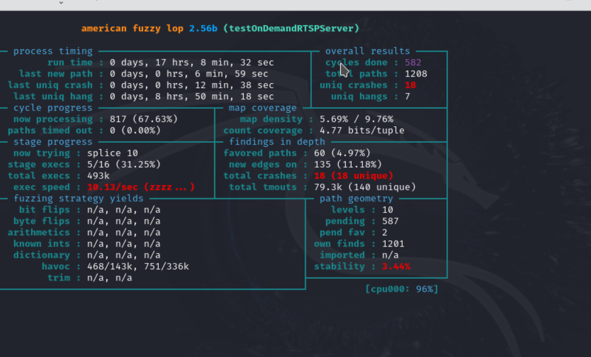
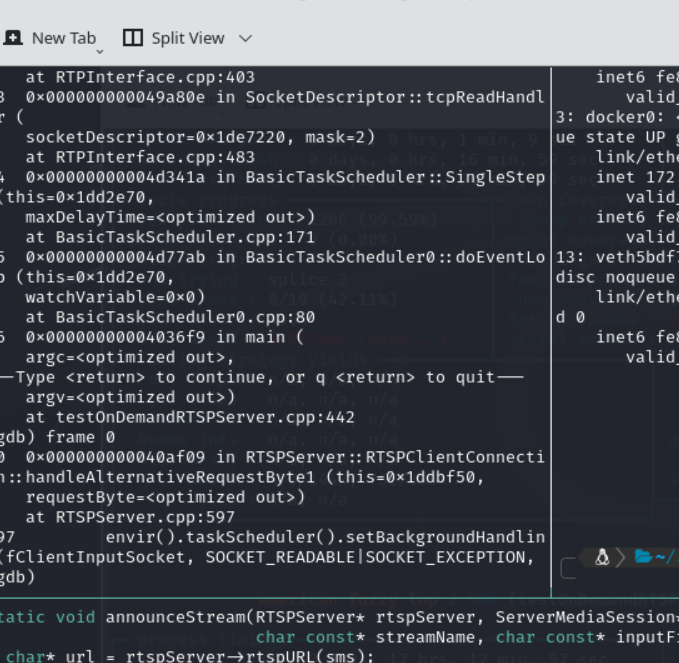

### HW4
what did i do? try to get it to run on wsl, problems
w]switched to Hyper-V, followed the instructions, and it didnt like the LLVM_CONFIG variable command. so c/p the dockerfile.  Ran it.  it worked.
after running the docker build and commands( PUt it here ), i had to navigate some cool tmux issues.  so ctrl-b c doesnt work to make a new window, but ctrl-t \ opens awindow vertically, and then ctrl-t - opens one horizontally. (thanks John B!)

so i have the doodad runing and now i want to ccheck it via the tutorial

now how to rn the check on a running docker image from another docker image(make sure to use the appropriate ip address)

### Running the scripts

So i ran " afl-fuzz -d -i $AFLNET/tutorials/live555/in-rtsp -o out-live555 -N tcp://127.0.0.1/8554 -x $AFLNET/tutorials/live555/rtsp.dict -P RTSP -D 10000 -q 3 -s 3 -E -K -R ./testOnDemandRTSPServer 8554" for ~13 hours on WSL kali.  


I also ran it on a hyper-v Kali instance. See :   In 17 hours, this instance found 18 crashes and 7 hangs.  
End that with a 'ctrl-C".  Then follow these directions: 
```
bash
cd $WORKDIR/live555/testProgs
# Start the server
❯ ./testOnDemandRTSPServer 8554
# Run aflnet-replay
❯ aflnet-replay $AFLNET/tutorials/live555/CVE_2019_7314.poc RTSP 8554

```
I used this command in a separate terminal after starting the server:  
```
zsh
sudo docker exec -it cd $WORKDIR/live555/testProgs aflnet-replay $AFLNET/tutorials/live555/CVE_2019_7314.poc RTSP 8554
```
That was not fruitful. Eventually this got me in:
```zsh
sudo docker exec -it <container_id> bash
```
### THE FUZZING

So finally through lots of trial and errors, this was the final conclusion.
Run gdb like this:
```
bash
gdb --args ./testOnDemandRTSPServer 8554

```
and then run this: 
```
bash 
aflnet-replay $AFLNET/tutorials/live555/CVE_2019_7314.poc RTSP 8554
```

Great.  Now we have a server running and gdb is going to give us some marvelous and really useful results when we see the errors!  HOORAY!  WE LOVE GDB!

gdb is pretty useful in this case. After running the commands above, we get a seg-fault, as we expected.  


Great.  Now we cooking with diesel. Slow and dirty.  We can see from this picture, that we have an error in RTSPServer.cpp line 597.  Lets take a look.  
We can use 'bt' and 'frame 0' from inside gdb to take a look at whats happening...errr not happening.

It looks like there is a function that is checking to validate traffic on port 80, and an alternative port at 8080.  The Fuzzer is finding some devilishness in this functiion:

```
c++
... }

  // Also, attempt to create a HTTP server for RTSP-over-HTTP tunneling.
  // Try first with the default HTTP port (80), and then with the alternative HTTP
  // port numbers (8000 and 8080).

  if (rtspServer->setUpTunnelingOverHTTP(80) || rtspServer->setUpTunnelingOverHTTP(8000) || rtspServer->setUpTunnelingOverHTTP(8080)) {
    *env << "\n(We use port " << rtspServer->httpServerPortNum() << " for optional RTSP-over-HTTP tunneling.)\n";
  } else {
    *env << "\n(RTSP-over-HTTP tunneling is not available.)\n";
  }

  env->taskScheduler().doEventLoop(); // does not return

  return 0; // only to prevent compiler warning
}
```
So there are a few things happening here.  The alternative port is failing. And if you look at this really long winded function that the snippet is coming from, you can see its a mess. It is too long to read. Anyways.  The alternative port is failing and causing a segfault.  
That's not especially useful.  Lets look at the backtrace.  This gives us a little more to work with.  We find out that the RTPInterface is failing (RTPINterface.cpp ) in lines 482, 483, 401, and the basicTaskScheduler is also failing at lines 80 and 171.  


Tutorial # 2

For this portion of this exercise, I attempted to do the 'lightFtp' tutorial.  I copied the docker file over to a Kali VM, built it, and had to add 'libcap-dev' to the dependencies in the docker file.  Here is the relevant portion of the docker file.
```
[in Dockerfile]
Run apt-get -y update && \
    apt-get -y install sudo \
    ...
    libcap-dev \
```

Then I built and ran it. I named it lftp. What a scintillating name!
```
bash
sudo docker build --tag lftp .
sudo docker run -it lftp
```

It has now been running in two instances for 1 day and 17 hours, give or take.  

Hmmm.  Seems to be some issue connecting back to my running Kali instance.  Let's go down a rabbit hole and see where it goes.

Ok to get back into the container run :
```
bash
docker exec -it <container_ID> /bin/bash
```
To get the container id run:
```
bash 
docker ps
```
You might have to run those as sudo.
Ok. Back in the container, and i can't see the running afl-fuzz.  Uh-oh.Is it still running?
Run 'ps' in the docker container at the command line, and see what comes up.
All i get is 'bash and ps'. Well. Lets see if the results were written to the right file.
Blargh.  Not there. 
Maybe it wasn't there, because last i checked both containers, afl-fuzz had found no hangs or crashes in 30 + hours.  Well. Run it again.


#### Results of ligthftp tutorial
While I am waiting for the fuzzer to run again, I will document the steps that will be next.
1. Run the program under gdb:
   ```
   bash
   gdb ./fftp fftp.conf 2200
   
   ```

2. Apply aflnet-replay:
   ```
   bash 
   aflnet-replay $AFLNET/tutorials/lightftp/<yourPocFile>  FTP 2200
   ```

   Now that you have this running and you have a few crashes or hangs you can find some fresh bugs!


